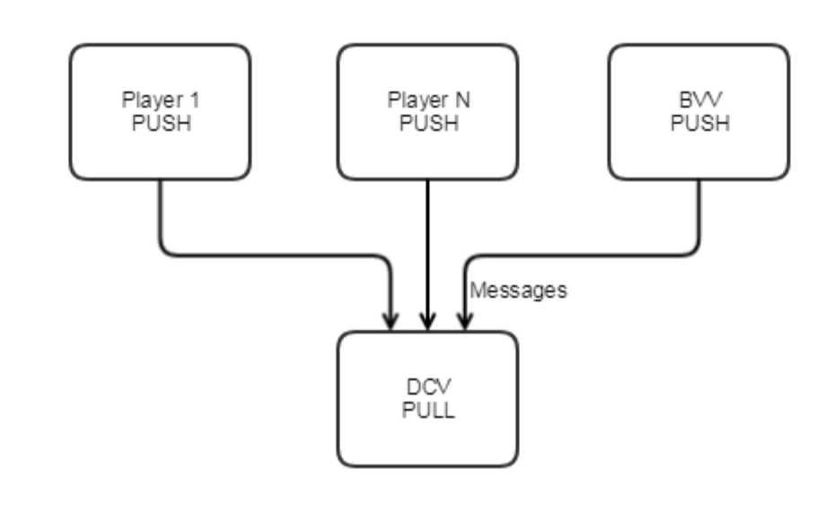
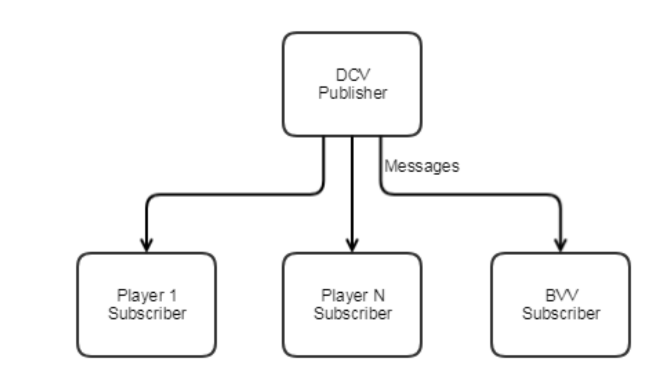

# Setup documentation for CHIPS Poker 

## About

This is a high level technical overview of everything you need to know about the CHIPS project. Each section has links provided for a more in-depth study.

[CHIPS FAQ](https://docs.chips.cash/en/latest/)

### Terms

`CHIPS` - game token and the name of the poker game project.

`Pangea` - protocol on which the poker game is based

`DCV` - Deck Creating Vendor, the Dealer

`BVV` - Blinding Value Vendor, the component that helps shuffling the deck

## Installation

At the current stage of the project there are a few options of how to install the game.

### Manual Installation

Note: Make sure to follow Install CHIPS-cli wallet first, the CHIPS daemon should be synced!

1. [Install CHIPS-cli wallet](https://docs.chips.cash/en/latest/install-cli.html)

2. [Install Lightning Network node](https://docs.chips.cash/en/latest/install-ln.html)

3. [Install BET](https://docs.chips.cash/en/latest/install-bet.html)

### Docker

## Infrastructure

CHIPS is a bitcoin fork. It uses lightening protocol for the micro transactions that happen withing the game.

### Message Communication

All the communication in the game must happen though `DCV`. Pangea Protocol does not allow any direct communication between the Players and the `BVV`. Players and `BVV` connect to `DCV` via `NN_PUSH/NN_PULL` socket. If any entity in the game is willing to send a message, it sends it to `DCV` via `NN_PUSH`, and `DCV` receives it via `NN_PULL`.

Once the `DCV` receives the messages it publishes it via `NN_PUB` and since Players and `BVV` are subscribed to `DCV` via `NN_SUB` so whenever the `DCV` publishes messages the Players and `BVV` receive it.

Source: Pangea Protocol Whitepaper (authors: [sg777](https://github.com/sg777), [jl777](https://github.com/jl777/))

If you want to know all the details please refer to the [Pangea Protocol Whitepaper](https://cdn.discordapp.com/attachments/455737840668770315/456036359870611457/Unsolicited_PANGEA_WP.pdf)

## More information on the project

[CHIPS documentation](https://docs.chips.cash/en/latest/)